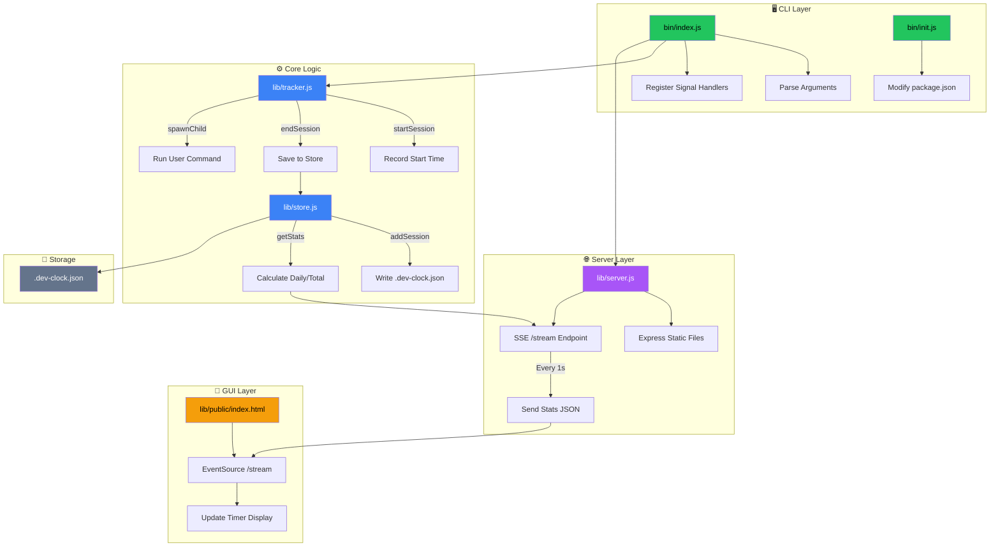

# Resource Detail for "Dev-Timr"

A CLI tool that automatically tracks development time with a real-time GUI timer.

**Author:** Allan Bezagrebere (@chemicalGhost)  
**Version:** 1.0.0  
**License:** ISC

---

## Tech Stack Overview

| Technology | Version | Purpose |
|------------|---------|---------|
| **Node.js** | 18+ | Runtime environment |
| **ES Modules** | ESM | Modern JavaScript module system |
| **Express.js** | ^4.18.2 | HTTP server for GUI |
| **Yargs** | ^17.7.2 | CLI argument parsing |
| **Chalk** | ^5.3.0 | Terminal styling |
| **Cross-Spawn** | ^7.0.3 | Cross-platform process spawning |
| **Open** | ^10.0.3 | Auto-open browser |
| **HTML/CSS/JS** | Vanilla | GUI interface |
| **SSE** | Native | Real-time updates |

---

## Dependencies Explained

### 1. Express.js
**Purpose:** Hosts the timer GUI on a local server.  
**Why:** Lightweight, widely-used HTTP framework. Serves static files and provides the `/stream` SSE endpoint for real-time updates.

### 2. Yargs
**Purpose:** Parses command-line arguments.  
**Why:** Handles variadic arguments (e.g., `dev-timr npm run dev`), generates help text, and provides a clean API for CLI tools.

### 3. Chalk
**Purpose:** Adds color to terminal output.  
**Why:** Improves user experience with colored success/error messages (green for success, red for errors, yellow for warnings).

### 4. Cross-Spawn
**Purpose:** Spawns child processes cross-platform.  
**Why:** Node's native `child_process.spawn` has issues on Windows with shell commands. Cross-spawn handles these edge cases automatically.

### 5. Open
**Purpose:** Opens the browser automatically.  
**Why:** Provides a seamless experience—users don't need to manually navigate to the timer GUI.

---

## File Structure

```
dev-timr/
├── bin/
│   ├── index.js      # Main CLI entry point
│   └── init.js       # Auto-setup command
├── lib/
│   ├── tracker.js    # Session management
│   ├── store.js      # Data persistence
│   ├── server.js     # Express server + SSE
│   └── public/
│       └── index.html  # Timer GUI
├── package.json
└── .gitignore
```

---

## Core Modules & Logic

### 1. `bin/index.js` - CLI Entry Point

**Purpose:** Main executable that orchestrates everything.

**Logic Flow:**
1. Parse CLI arguments using Yargs
2. Validate that a command was provided
3. Register signal handlers (SIGINT/SIGTERM) to save on exit
4. Start the session timer
5. Start the Express server (opens browser)
6. Spawn the user's command as a child process
7. Wait for child to exit, then save session and exit

**Key Code:**
```javascript
process.on('SIGINT', () => {
    endSession();  // Save before exit
    process.exit(0);
});
startSession();
startServer();
const child = spawnChild(fullCommandString);
```

---

### 2. `bin/init.js` - Auto-Setup Command

**Purpose:** Automatically modifies a project's `package.json` to wrap scripts.

**Logic Flow:**
1. Read the target project's `package.json`
2. Find `dev` and `start` scripts
3. Wrap them with `dev-timr "..."`
4. Save the modified `package.json`

**Key Code:**
```javascript
packageJson.scripts[scriptName] = `dev-timr "${script}"`;
```

---

### 3. `lib/tracker.js` - Session Management

**Purpose:** Tracks session start/end times and spawns child processes.

**Functions:**
| Function | Purpose |
|----------|---------|
| `startSession()` | Records start timestamp |
| `endSession()` | Calculates duration, saves to store |
| `getDuration()` | Returns current session length (ms) |
| `spawnChild(cmd)` | Runs user's command with `shell: true` |

**Key Logic:**
```javascript
let startTime = null;

export function startSession() {
    startTime = Date.now();
}

export function getDuration() {
    return Date.now() - startTime;
}
```

---

### 4. `lib/store.js` - Data Persistence

**Purpose:** Reads/writes session data to `.dev-clock.json`.

**Data Structure:**
```json
{
  "sessions": [
    { "start": 1736640000000, "end": 1736643600000 },
    { "start": 1736726400000, "end": 1736730000000 }
  ]
}
```

**Functions:**
| Function | Purpose |
|----------|---------|
| `addSession(session)` | Appends session to store |
| `getStats()` | Calculates `todayMs` and `totalMs` |

**Stats Calculation Logic:**
```javascript
for (const session of store.sessions) {
    const duration = session.end - session.start;
    totalMs += duration;
    if (sessionDate === todayString) {
        todayMs += duration;
    }
}
```

---

### 5. `lib/server.js` - Express Server + SSE

**Purpose:** Hosts the GUI and streams real-time updates.

**Endpoints:**
| Endpoint | Method | Purpose |
|----------|--------|---------|
| `/` | GET | Serves `index.html` |
| `/stream` | GET | SSE endpoint for live updates |

**SSE Logic:**
```javascript
app.get('/stream', (req, res) => {
    res.setHeader('Content-Type', 'text/event-stream');
    
    const sendStats = () => {
        const data = {
            currentSession: getDuration(),
            todayTotal: stats.todayMs + getDuration(),
            allTimeTotal: stats.totalMs + getDuration()
        };
        res.write(`data: ${JSON.stringify(data)}\n\n`);
    };
    
    setInterval(sendStats, 1000);
});
```

---

### 6. `lib/public/index.html` - Timer GUI

**Purpose:** Displays the timer in a browser window.

**Features:**
- Dark theme with glassmorphism-style card
- Real-time countdown using SSE
- Shows: Current Session, Today's Total, All Time Total
- Turns red when connection is lost

**Key JavaScript:**
```javascript
const evtSource = new EventSource('/stream');
evtSource.onmessage = function(event) {
    const data = JSON.parse(event.data);
    currentEl.textContent = formatTime(data.currentSession);
};
```

---

## Setup Guide

### Prerequisites
- Node.js 18+ installed
- npm or yarn

### Installation

**1. Clone/Download the repository:**
```bash
cd ~/Documents/Github
git clone <repo-url> dev-timr
cd dev-timr
```

**2. Install dependencies:**
```bash
npm install
```

**3. Link globally:**
```bash
npm link
```

### Usage in Projects

**Method 1: Auto-setup (Recommended)**
```bash
cd /path/to/your/project
npm link dev-timr
dev-timr-init
npm run dev
```

**Method 2: Manual setup**

Edit your project's `package.json`:
```json
{
  "scripts": {
    "dev": "dev-timr \"next dev --turbopack\""
  }
}
```

Then run:
```bash
npm link dev-timr
npm run dev
```

### Uninstall from a project
```bash
npm unlink dev-timr
```

Remove `dev-timr` from your scripts manually.

---

## System Architecture Mind Map



### Data Flow Summary

```
User runs: npm run dev
           ↓
    bin/index.js starts
           ↓
    ┌──────┴──────┐
    ↓             ↓
tracker.js    server.js
(start time)  (start server)
    ↓             ↓
    ↓         Opens browser
    ↓             ↓
spawn child   GUI connects
process       via SSE
    ↓             ↓
User works    Timer updates
    ↓          every 1s
    ↓             ↓
User hits     GUI shows
Ctrl+C        current time
    ↓
endSession()
    ↓
store.js saves
to .dev-clock.json
```

---

## Key Design Decisions

| Decision | Rationale |
|----------|-----------|
| **SSE over WebSockets** | Simpler, one-way communication is sufficient |
| **JSON file storage** | No database needed, portable, human-readable |
| **Dynamic port (0)** | Avoids conflicts with existing servers |
| **shell: true in spawn** | Supports complex commands like `npm run dev` |
| **process.cwd() for store** | Each project gets its own `.dev-clock.json` |

---

## Troubleshooting

| Issue | Solution |
|-------|----------|
| "command not found: dev-timr" | Run `npm link` in dev-timr directory |
| Browser doesn't open | Check firewall, or open URL manually |
| Session not saved | Ensure you exit with Ctrl+C, not killing terminal |
| Old data from wrong project | Check you're in the correct directory |

---

*Created by Allan Bezagrebere (@chemicalGhost)*
